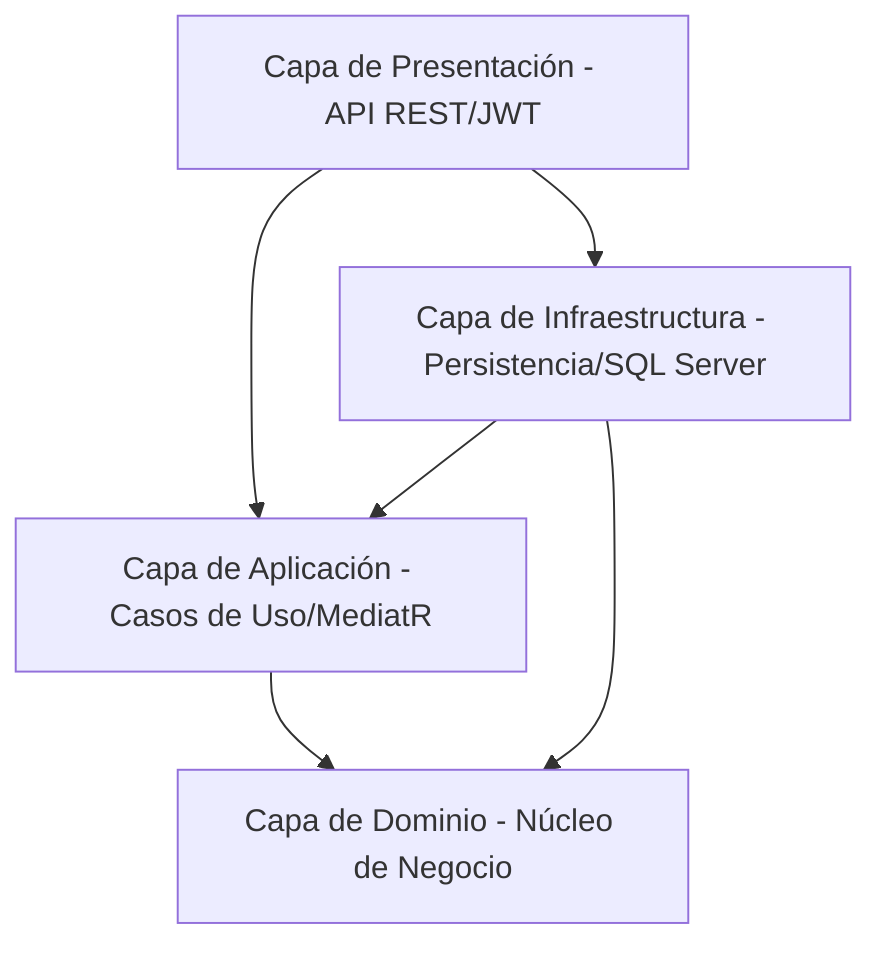

# Sistema de Gestión de Inventario y Ventas (InventorySalesApi)

Este es un sistema corporativo para la administración y control de inventarios, movimientos de stock y facturación de ventas, construido bajo principios avanzados de diseño de software. Diseñado para funcionar a escala, implementa prácticas industriales de **Domain-Driven Design (DDD)** y **Onion Architecture (Arquitectura de Cebolla)**.

---

## 🏗️ Arquitectura y Diseño

El proyecto sigue la **Onion Architecture**, asegurando un acoplamiento débil entre componentes y aislando el dominio de las preocupaciones de infraestructura.



### Principios de Diseño
- **Domain-Driven Design (DDD)**: El núcleo modela entidades de negocio ricas en lógica (`Producto`, `Cliente`, `Venta`, `MovimientoStock`), objetos de valor inmutables (`Money`, `Email`), agregados y raíces de agregado.
- **CQRS con MediatR**: Separación nítida de consultas (Queries) y comandos (Commands) para maximizar la mantenibilidad del sistema.
- **Validación Automática**: Reglas sintácticas implementadas con **FluentValidation** mediante comportamientos de tubería (Pipeline Behaviors) en MediatR.
- **Inyección de Dependencias**: Acoplamiento desacoplado mediante interfaces para la infraestructura y servicios auxiliares.

---

## 🛠️ Tecnologías y Librerías

- **Plataforma**: .NET 10.0 C#
- **ORM**: Entity Framework Core 10.0 (Code-First)
- **Base de Datos**: SQL Server 2022
- **Seguridad**: JWT Bearer Authentication & BCrypt para hashing de contraseñas
- **Documentación**: Swagger/OpenAPI v2.0.0
- **Auditoría e Historial (Logging)**: Serilog con guardado estructurado y rolling files diarios
- **Monitoreo**: Health Checks integrados para API y base de datos SQL Server
- **Contenedores**: Docker y Docker Compose (con comprobaciones de salud automáticas)
- **Pruebas**: xUnit, FluentAssertions, Moq, WebApplicationFactory (InMemory Database aislada)

---

## 📂 Estructura de la Solución

```text
InventorySalesApi/
├── src/
│   ├── InventorySalesApi.Domain/        # Entidades, Agregados, Excepciones, Reglas de negocio y Value Objects
│   ├── InventorySalesApi.Application/   # Casos de uso (Commands/Queries), DTOs, Validadores e Interfaces
│   ├── InventorySalesApi.Infrastructure/# Persistencia (AppDbContext), Repositorios, Sembrado y Migraciones
│   └── InventorySalesApi.Api/           # Endpoints, Middlewares, Filtros, Controladores y Configuración (Serilog/JWT)
├── tests/
│   ├── InventorySalesApi.UnitTests/     # Pruebas unitarias de dominio y casos de uso con Moq y FluentAssertions
│   └── InventorySalesApi.IntegrationTests/# Pruebas de integración con WebApplicationFactory y DB en memoria
├── InventorySalesApi.postman_collection.json # Colección de solicitudes HTTP para pruebas rápidas
├── docker-compose.yml                   # Orquestación de contenedores (API + Base de Datos)
└── Dockerfile                           # Definición de empaquetado y salud de la aplicación
```

---

## 🔐 Credenciales de Prueba (Auto-Seeding)

La base de datos se inicializa y siembra automáticamente al arrancar la aplicación con los siguientes usuarios de prueba (contraseñas hasheadas):

| Nombre de Usuario | Correo Electrónico | Contraseña | Rol (JWT Claim) | Permisos |
| :--- | :--- | :--- | :--- | :--- |
| **admin** | `admin@sistema.com` | `AdminPassword123!` | `Administrador` | Acceso total al sistema |
| **vendedor** | `vendedor@sistema.com` | `VendedorPassword123!` | `Vendedor` | Ventas, Clientes y Consulta de productos |
| **operador** | `operador@sistema.com` | `OperadorPassword123!` | `Operador` | Stock (Entradas/Salidas) y Consulta de productos |

---

## ⚡ Cómo Ejecutar la Aplicación

### Opción A: Mediante Docker (Recomendado)
Requiere tener Docker Desktop instalado.

1. Abre una terminal en la raíz del proyecto.
2. Levanta los contenedores con Docker Compose:
   ```bash
   docker-compose up --build
   ```
3. Docker esperará a que SQL Server esté listo (`service_healthy`) antes de arrancar e inicializar la API.
4. Una vez listos, accede a la documentación interactiva Swagger en:
   - [http://localhost:5000/swagger](http://localhost:5000/swagger)
5. Puedes verificar el estado de salud en:
   - [http://localhost:5000/health](http://localhost:5000/health)

### Opción B: Ejecución Local
Requiere tener instalado el SDK de .NET 10 y SQL Server local.

1. Configura tu cadena de conexión en `src/InventorySalesApi.Api/appsettings.json` o mediante variables de entorno.
2. Compila el proyecto:
   ```bash
   dotnet build
   ```
3. Ejecuta la aplicación de presentación:
   ```bash
   dotnet run --project src/InventorySalesApi.Api/InventorySalesApi.Api.csproj
   ```

---

## 🧪 Ejecución de Pruebas (Tests)

### Pruebas Unitarias
Prueban de manera aislada las entidades del dominio (Producto, Cliente, Venta, MovimientoStock) y sus handlers usando mocks con **Moq**:
```bash
dotnet test tests/InventorySalesApi.UnitTests/InventorySalesApi.UnitTests.csproj
```

### Pruebas de Integración
Levantan un servidor web simulado (`WebApplicationFactory`) y prueban la base de datos en memoria para validar la autenticación, flujos de validación (RFC 7807) y las reglas de seguridad basadas en roles (JWT):
```bash
dotnet test tests/InventorySalesApi.IntegrationTests/InventorySalesApi.IntegrationTests.csproj
```

---

## ⚙️ Monitoreo, Logs y Manejo de Errores

- **Health Checks**: Endpoint `/health` expuesto para monitorear el estado del servidor y la base de datos.
- **Logging Estructurado**: Los registros se graban en la consola y de forma persistente en `Logs/log-.txt` con rotación diaria. Registra inicios de sesión y solicitudes HTTP automáticamente.
- **ProblemDetails RFC 7807**: Todas las excepciones de negocio (`DomainException`, `NotFoundException`), de validación (`ValidationException`) y errores del sistema devuelven respuestas JSON homogéneas:
  ```json
  {
    "type": "https://tools.ietf.org/html/rfc7231#section-6.5.4",
    "title": "Recurso no Encontrado",
    "status": 404,
    "detail": "El producto con ID X no existe.",
    "instance": "/api/v1/productos/X"
  }
  ```
